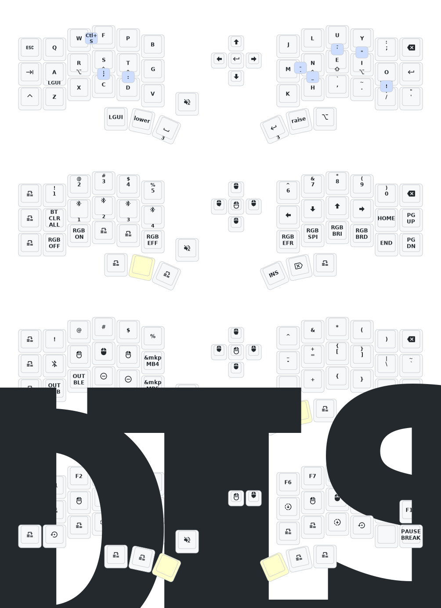

# ZMK for Corne-j keyboard

I don't have the keyboard yet. The Corne-j is a Chinese-built variant of the
Corne v3, with an nRF MCU, Sharp low-power screens, a rotary encoder and a
five-way switch.

